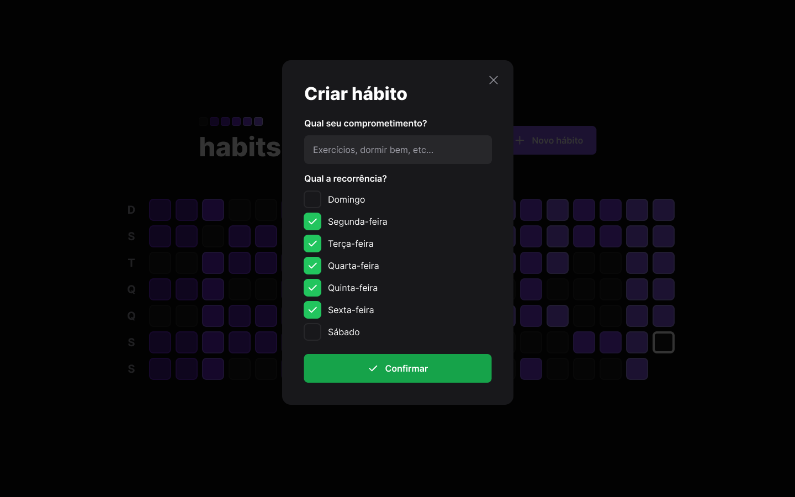

# NLW Setup - Habits

Project developed by [Hállex Costa](https://github.com/hallexcosta) together with instructors [Diego Fernades](https://github.com/diego3g) and [Rodrigo Gonçalves](https://github.com/rodrigorgtic)
  
The project is a Habit Tracker, that allow a user to create a new Habit and see your summary of habits completed 
or non-completed changing the colors tone acoordingly with progress of user.

### Technologies used

- [x] [Typescript](https://typescriptlang.org) (For add types to javascript)
- [x] [Expo](https://expo.dev) (For create react native project app)
- [x] [React Reanimated](https://docs.swmansion.com/react-native-reanimated/) (For create animation in check box and progress bar in React Native)
- [x] [TailwindCSS](https://tailwindcss.com/) (For apply styles of pages, utilizing framework css that following pattern of utility-first)
- [x] [Nativewind](https://nativewind.dev) (For apply styles of screens following the same concepts TailwindCSS but for React Native)
- [x] [Vite](https://vite.dev) (For create react webapp)
- [x] [Radix](https://radix-ui.com) (For accessibility of elements from HTML, for the sensors of write identify the content of page)
- [x] [Fastify](https://fastify.io) (For create server API and define the enpoints)
- [x] [Prisma](https://prisma.io) (For create migrations, database SQLite and persists data on database)
- [x] [Nx](https://nx.dev) (I'm chosen Nx to seen how it tool work like build system, together with monorepo architecture)

### Future Features

- [ ] Notifications on Web
- [ ] Notifications on Mobile
- [x] Authenticate with [Firebase](https://console.firebase.google.com) or [Nhost](https://nhost.io)
- [ ] Deploy API on [Render](https://render.com)
- [ ] Deploy Web on [Netlify](https://netlify.com), [Vercel](https://vercel.com) or [Render](https://render.com)
- [ ] Apply Clean Architecture on Frontend
- [ ] Apply Clean Architecture on Backend

For access info and descriptions of endpoints from API click to [here](./docs/ENDPOINTS.md)

### Web Version

### Mobile Version

